# Архитектура Fitness App — Backend

> Полное описание архитектуры, флоу и алгоритмов серверной части фитнес-приложения.

---

## Содержание

1. [Обзор системы](#1-обзор-системы)
2. [ER-диаграмма базы данных](#2-er-диаграмма-базы-данных)
3. [Флоу: Создание одиночной тренировки (MILP)](#3-флоу-создание-одиночной-тренировки-milp)
4. [Флоу: Создание тренировки через диалог](#4-флоу-создание-тренировки-через-диалог)
5. [Флоу: Прохождение тренировки](#5-флоу-прохождение-тренировки)
6. [Флоу: Планирование тренировок](#6-флоу-планирование-тренировок)
7. [MILP Solver — детальное описание](#7-milp-solver--детальное-описание)
8. [Weekly Process MILP — генерация недельного плана](#8-weekly-process-milp--генерация-недельного-плана)
9. [AI-Powered SetPlanner](#9-ai-powered-setplanner)
10. [Dialog System](#10-dialog-system)
11. [Chat System](#11-chat-system)
12. [Справочник модулей и API](#12-справочник-модулей-и-api)

---

## 1. Обзор системы

### 1.1 Назначение

Backend фитнес-приложения обеспечивает:
- Персональную генерацию тренировок на основе MILP-оптимизации
- Составление недельных и многомесячных тренировочных планов
- AI-предсказание рабочих весов и планирование подходов
- Конверсационный интерфейс для создания тренировок через чат
- Полный жизненный цикл тренировочной сессии (планирование → выполнение → анализ)

### 1.2 Стек технологий

| Компонент | Технология |
|-----------|-----------|
| Framework | NestJS (TypeScript) |
| База данных | PostgreSQL (`fitness_app`) |
| Аутентификация | JWT (device-based) |
| MILP Solver | `javascript-lp-solver` (Binary Integer Programming) |
| ML Inference | XGBoost / LightGBM (ONNX runtime) |
| Планировщик | `@nestjs/schedule` (cron) |
| Порт | 3001 |

### 1.3 Архитектурная схема (Component Diagram)

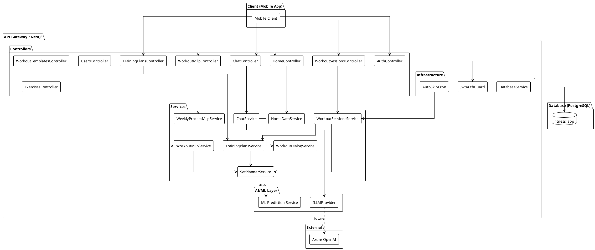

### 1.4 Принципы архитектуры

- **Dependency Injection** — все репозитории инжектируются через Symbol-токены
- **Repository Pattern** — интерфейсы `I*Repository` + SQL-реализации
- **Entity Layer** — TypeScript-интерфейсы без ORM (plain objects)
- **"null = MILP считает"** — null-поля в DTO означают автоматический расчёт
- **Один активный план** — `isActive: true` может быть только у одного TrainingPlan на пользователя

---

## 2. ER-диаграмма базы данных

```plantuml
@startuml FitnessApp_ER
!theme plain
skinparam linetype ortho
skinparam entity {
    BackgroundColor<<core>> #E8F5E9
    BackgroundColor<<session>> #E3F2FD
    BackgroundColor<<chat>> #FFF3E0
    BackgroundColor<<plan>> #F3E5F5
}

entity "users" as users <<core>> {
    * id : TEXT <<PK>>
    --
    device_id : TEXT <<UNIQUE>>
    name : TEXT
    gender : TEXT
    weight : REAL
    height : REAL
    age : INT
    metadata : JSONB
    created_at : TIMESTAMP
}

entity "user_contraindications" as user_contra <<core>> {
    * user_id : TEXT <<FK>>
    * contraindication_id : INT <<FK>>
}

entity "bodyparts" as bodyparts <<core>> {
    * id : SERIAL <<PK>>
    --
    name : TEXT
    slug : TEXT <<UNIQUE>>
}

entity "muscles" as muscles <<core>> {
    * id : SERIAL <<PK>>
    --
    name : TEXT
    slug : TEXT
}

entity "muscle_antagonists" as muscle_antag <<core>> {
    * muscle_id : INT <<FK>>
    * antagonist_id : INT <<FK>>
}

entity "equipments" as equipments <<core>> {
    * id : SERIAL <<PK>>
    --
    name : TEXT
    slug : TEXT
    description : TEXT
    image_url : TEXT
}

entity "equipment_presets" as eq_presets <<core>> {
    * id : TEXT <<PK>>
    --
    user_id : TEXT <<FK>>
    name : TEXT
    slug : TEXT
    is_system : BOOLEAN
    equipment_slugs : TEXT[]
    created_at : TIMESTAMP
    updated_at : TIMESTAMP
}

entity "contraindications" as contraindications <<core>> {
    * id : SERIAL <<PK>>
    --
    name : TEXT
    slug : TEXT
}

entity "exercises" as exercises <<core>> {
    * id : SERIAL <<PK>>
    --
    exercise_id : TEXT <<UNIQUE>>
    name : TEXT
    slug : TEXT <<UNIQUE>>
    gif_url : TEXT
    instructions : TEXT[]
    alias : TEXT[]
    exercise_type : TEXT
    description : TEXT
    confidence : REAL
    difficulty : TEXT
    movement_pattern : TEXT
    variations : TEXT[]
    metadata : JSONB
}

entity "exercise_target_muscles" as ex_target <<core>> {
    * exercise_id : INT <<FK>>
    * muscle_id : INT <<FK>>
}

entity "exercise_secondary_muscles" as ex_secondary <<core>> {
    * exercise_id : INT <<FK>>
    * muscle_id : INT <<FK>>
}

entity "exercise_body_parts" as ex_bodypart <<core>> {
    * exercise_id : INT <<FK>>
    * bodypart_id : INT <<FK>>
}

entity "exercise_equipments" as ex_equip <<core>> {
    * exercise_id : INT <<FK>>
    * equipment_id : INT <<FK>>
}

entity "exercise_contraindications" as ex_contra <<core>> {
    * exercise_id : INT <<FK>>
    * contraindication_id : INT <<FK>>
    severity : TEXT
}

entity "workout_templates" as templates <<session>> {
    * id : TEXT <<PK>>
    --
    user_id : TEXT <<FK>>
    name : TEXT
    description : TEXT
    metadata : JSONB
    created_at : TIMESTAMP
    updated_at : TIMESTAMP
}

entity "workout_exercises" as tpl_exercises <<session>> {
    * id : SERIAL <<PK>>
    --
    template_id : TEXT <<FK>>
    exercise_slug : TEXT
    sets : INT
    reps : INT
    rest_between_sets : INT
    rest_after_exercise : INT
    sort_order : INT
}

entity "training_plans" as plans <<plan>> {
    * id : TEXT <<PK>>
    --
    user_id : TEXT <<FK>>
    name : TEXT
    is_active : BOOLEAN
    source : TEXT
    created_at : TIMESTAMP
}

entity "training_plan_schedule" as plan_schedule <<plan>> {
    * plan_id : TEXT <<FK>>
    * day_of_week : TEXT
    --
    workout_template_id : TEXT <<FK>>
    time : TEXT
    name : TEXT
    sort_order : INT
}

entity "training_plan_sessions" as plan_sessions <<plan>> {
    * id : TEXT <<PK>>
    --
    plan_id : TEXT <<FK>>
    user_id : TEXT <<FK>>
    started_at : DATE
    current_week : INT
    status : TEXT
    created_at : TIMESTAMP
}

entity "workout_sessions" as sessions <<session>> {
    * id : TEXT <<PK>>
    --
    plan_session_id : TEXT <<FK>>
    user_id : TEXT <<FK>>
    day_of_week : TEXT
    time : TEXT
    week_number : INT
    status : TEXT
    metadata : JSONB
}

entity "workout_session_exercises" as session_ex <<session>> {
    * session_id : TEXT <<FK>>
    * exercise_slug : TEXT <<PK>>
    --
    sets : INT
    ordering : INT
    metadata : JSONB
}

entity "workout_session_sets" as session_sets <<session>> {
    * session_id : TEXT <<FK>>
    * exercise_slug : TEXT
    * set_number : INT
    --
    set_type : TEXT
    planned_weight_kg : REAL
    planned_reps : INT
    planned_duration_sec : INT
    planned_distance_m : INT
    actual_weight_kg : REAL
    actual_reps : INT
    actual_duration_sec : INT
    actual_distance_m : INT
    actual_rpe : REAL
    completed_at : TIMESTAMP
}

entity "chat_sessions" as chat_sessions <<chat>> {
    * id : TEXT <<PK>>
    --
    user_id : TEXT <<FK>>
    mode : TEXT
    dialog_id : TEXT
    title : TEXT
    created_at : TIMESTAMP
    updated_at : TIMESTAMP
}

entity "chat_messages" as chat_messages <<chat>> {
    * id : TEXT <<PK>>
    --
    session_id : TEXT <<FK>>
    role : TEXT
    content : TEXT
    metadata : JSONB
    created_at : TIMESTAMP
}

entity "workout_dialogs" as dialogs <<chat>> {
    * id : TEXT <<PK>>
    --
    user_id : TEXT <<FK>>
    current_step : TEXT
    plan_type : TEXT
    collected_params : JSONB
    created_at : TIMESTAMP
    updated_at : TIMESTAMP
}

entity "weight_logs" as weight_logs <<core>> {
    * id : UUID <<PK>>
    --
    user_id : TEXT <<FK>>
    weight : REAL
    created_at : TIMESTAMP
}

entity "scheduled_workouts" as scheduled <<session>> {
    * id : TEXT <<PK>>
    --
    template_id : TEXT <<FK>>
    user_id : TEXT <<FK>>
    day_of_week : TEXT
    time : TEXT
    created_at : TIMESTAMP
}

users ||--o{ user_contra
users ||--o{ templates
users ||--o{ plans
users ||--o{ plan_sessions
users ||--o{ sessions
users ||--o{ chat_sessions
users ||--o{ dialogs
users ||--o{ weight_logs
users ||--o{ eq_presets

contraindications ||--o{ user_contra
contraindications ||--o{ ex_contra

muscles ||--o{ ex_target
muscles ||--o{ ex_secondary
muscles ||--o{ muscle_antag

bodyparts ||--o{ ex_bodypart
equipments ||--o{ ex_equip
equipments ||--o{ eq_presets

exercises ||--o{ ex_target
exercises ||--o{ ex_secondary
exercises ||--o{ ex_bodypart
exercises ||--o{ ex_equip
exercises ||--o{ ex_contra

templates ||--o{ tpl_exercises
templates ||--o{ plan_schedule
templates ||--o{ scheduled

plans ||--o{ plan_schedule
plans ||--o{ plan_sessions

plan_sessions ||--o{ sessions
sessions ||--o{ session_ex
sessions ||--o{ session_sets

chat_sessions ||--o{ chat_messages
chat_sessions ||--o? dialogs

@enduml
```

---

## 3. Флоу: Создание одиночной тренировки (MILP)

### 3.1 UseCase Diagram

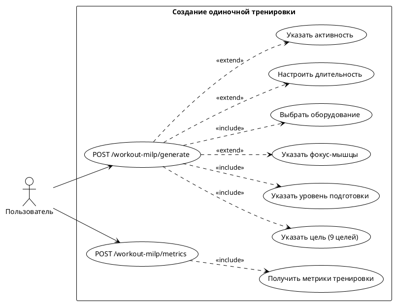

### 3.2 UserFlow Diagram

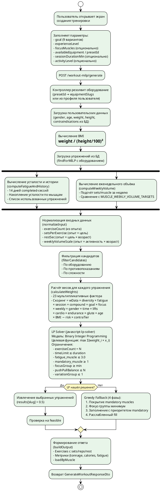

### 3.3 Activity Diagram

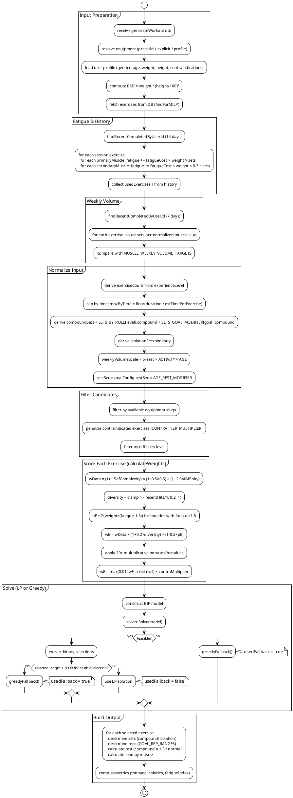

---

## 4. Флоу: Создание тренировки через диалог

### 4.1 UseCase Diagram

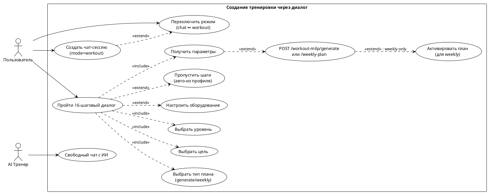

### 4.2 UserFlow Diagram

```plantuml
@startuml WorkoutDialog_UserFlow
!theme plain
skinparam ActivityBackgroundColor #FFF3E0
skinparam ActivityDiamondBackgroundColor #FFF9C4

start

:Пользователь создаёт чат-сессию\nPOST /chat/sessions {mode: "workout"};

:ChatService.createSession()
→ создаёт chat_sessions
→ WorkoutDialogService.startDialog()
→ создаёт workout_dialogs;

:Загрузка данных из профиля:\n- goal → auto-skip goal step\n- experienceLevel → auto-skip\n- availableEquipment → auto-skip equipment;

:Определение первого шага\n(getNextStep с учётом\nпропущенных из профиля);

repeat
    :Отправка вопроса пользователю\n(step, question, options, inputType);
    
    :Пользователь отвечает\nPOST /chat/sessions/:id/messages {content};
    
    :Валидация single_choice\n(неверный ответ → повтор вопроса);
    
    :applyAnswer → сохранение в collectedParams;
    
    :Обработка пресета оборудования\n(если preset → подстановка equipmentSlugs);
    
    :getNextStep() с conditional routing:
    
    if (advanced_settings = "recommended"?) then (Да)
        :Пропуск advanced шагов\n(split, activity, cardio, lifts, etc.);
    else (Нет — manual)
        if (goal = weight_loss OR endurance?) then (Да)
            :Шаг cardio_preference;
        else (Нет)
            :Пропуск cardio_preference;
        endif
        
        if (goal = strength OR glute_growth?) then (Да)
            :Шаг primary_lifts;
        endif
        
        if (goal = endurance?) then (Да)
            :Шаг endurance_type;
        endif
        
        if (goal = weight_loss?) then (Да)
            :Шаг target_weight;
        endif
    endif
    
repeat while (nextStep = "complete"?) is (Нет)
-> Да;

:buildFinalParams(collectedParams, planType);

if (planType = "weekly"?) then (Да)
    :POST /workout-milp/weekly-plan\nс параметрами диалога;
    
    :WeeklyProcessMilpService:
    - Выбор сплита (SPLIT_STRATEGIES)
    - Распределение мышц по дням
    - Генерация N сессий через MILP
    - Создание WorkoutTemplate × N
    - Создание TrainingPlan (isActive: false)
    - Создание TrainingPlanSchedule;
    
    :Пользователь активирует план:\nPOST /training-plans/:id/activate;
    
    :TrainingPlansService.activate():
    - Деактивация других планов
    - Создание PlanSession (4 недели)
    - Создание WorkoutSessions из шаблонов
    - SetPlanner для ближайшей сессии;
    
else (Нет — generate)
    :POST /workout-milp/generate\nс параметрами диалога;
    note right: Возвращает упражнения,\nно НЕ создаёт сессию автоматически
endif

stop
@enduml
```

### 4.3 Activity Diagram (диалог)

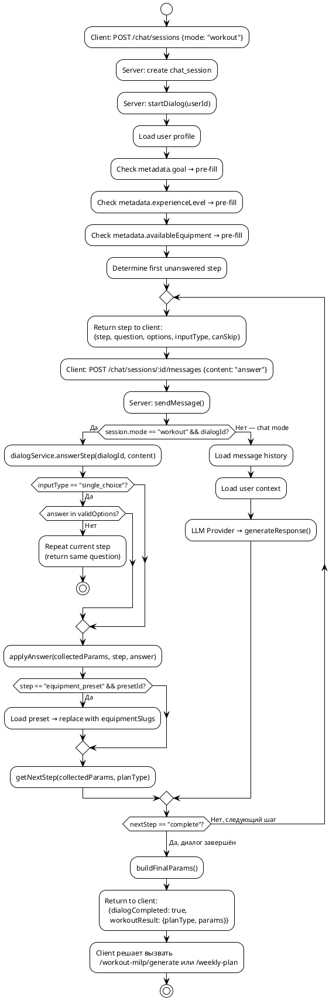

---

## 5. Флоу: Прохождение тренировки

### 5.1 UseCase Diagram

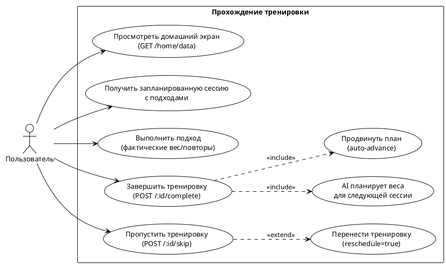

### 5.2 UserFlow Diagram

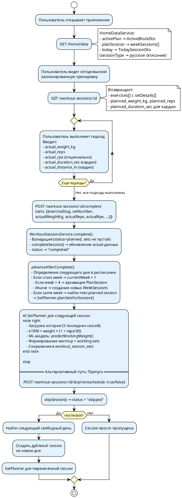

### 5.3 Activity Diagram

```plantuml
@startuml WorkoutExecution_Activity
!theme plain

start

:GET /home/data → todaySession;

if (todaySession exists?) then (Да)
    :GET /workout-sessions/:id
    → exercises + setDetails (planned sets);
    
    partition "Выполнение тренировки" {
        repeat
            :Пользователь выполняет подход;
            :Вводит actual данные:
              weight, reps, rpe, duration, distance;
        repeat while (Подходы остались?) is (Да)
        -> Нет;
    }
    
    :POST /workout-sessions/:id/complete
      {sets: [...actual data...]};
    
    :Update workout_session_sets
      SET actual_weight_kg, actual_reps,
          actual_rpe, completed_at
      WHERE session_id AND exercise_slug AND set_number;
    
    :UPDATE workout_sessions
      SET status = 'completed';
    
    partition "Plan Advancement" {
        :Find next scheduled day;
        
        if (Cross week boundary?) then (Да)
            if (currentWeek + 1 > 4?) then (Да)
                :Archive plan session;
                note right: План завершён (4 недели)
                stop
            else (Нет)
                :Increment currentWeek;
                :Create new week sessions
                  from templates;
            endif
        else (Нет — same week)
            :Find next planned session
              for next day;
        endif
        
        :Run SetPlanner for next session;
    }
    
else (Нет todaySession)
    :Display "Нет тренировок на сегодня";
endif

stop

== Cron: AutoSkip (полночь ежедневно) ==

:AutoSkipCron.handleStalePlannedSessions();
:Find sessions where status='planned'
  AND day_of_week < today;
:For each stale: skipSession(id, autoSkipped=true);
note right: status → 'skipped',\nmetadata.autoSkipped = true

@enduml
```

---

## 6. Флоу: Планирование тренировок

### 6.1 UseCase Diagram

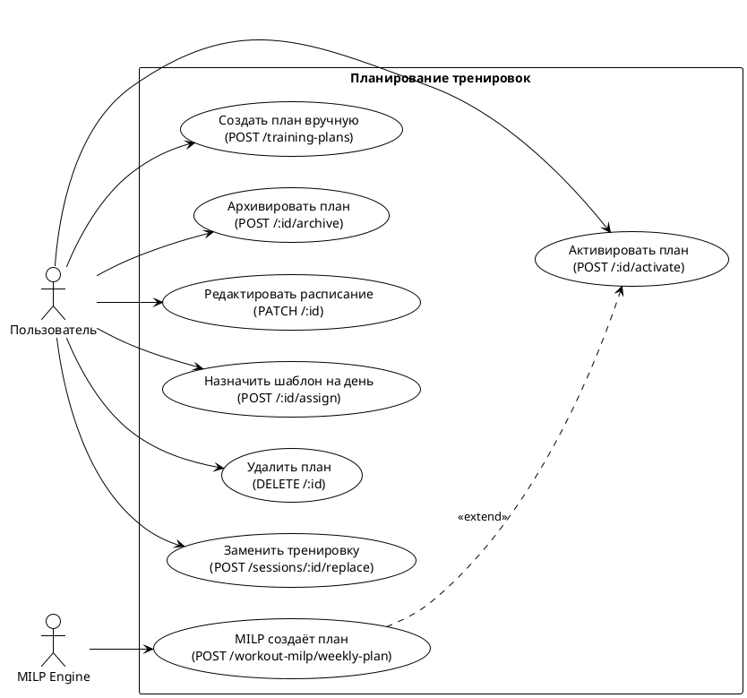

### 6.2 UserFlow Diagram

```plantuml
@startuml TrainingPlan_UserFlow
!theme plain
skinparam ActivityBackgroundColor #F3E5F5
skinparam ActivityDiamondBackgroundColor #FFF9C4

start

partition "Создание плана (MILP)" {
    :POST /workout-milp/weekly-plan\n{goal, experience, equipment, days, ...};
    
    :WeeklyProcessMilpService.generateWeeklyPlan():
    - Выбор сплита по SPLIT_STRATEGIES
    - Определение SESSION_MUSCLE_FOCUS на каждый слот
    - Цикл по слотам: generateWorkout() для каждого
    - Учёт кросс-сессионного объёма
    - Декэй усталости между днями (λ=0.345);
    
    :Создание WorkoutTemplate × N\n(по одному на каждый training day);
    :Создание TrainingPlan
      {isActive: false, source: 'milp'};
    :Создание TrainingPlanSchedule\n(day_of_week → template_id);
    
    :Return: planId, splitName, sessions[],\ntotalWeeklyLoad, weeklyVolumeByMuscle;
}

partition "Активация" {
    :POST /training-plans/:id/activate;
    
    :planService.activate():
    1. Деактивировать другие планы
    2. Архивировать старый PlanSession
    3. Активировать план (isActive=true)
    4. Создать PlanSession (4 недели, week=1)
    5. Создать WorkoutSession для каждого дня расписания
       → чтение упражнений из WorkoutTemplate
    6. Найти ближайший upcoming session
    7. SetPlanner.planSetsForSession(nearest);
}

partition "Жизненный цикл" {
    repeat
        :Пользователь выполняет тренировки;
        :После complete → advanceAfterComplete();
        :SetPlanner для следующей сессии;
        
        if (Неделя завершена?) then (Да)
            if (week 4?) then (Да)
                :Архивация PlanSession;
                stop
            else (Нет)
                :week++
                Создание новых WeekSessions;
            endif
        endif
    repeat while (План активен?) is (Да)
    -> Нет;
}

partition "Архивация" {
    :POST /training-plans/:id/archive;
    :isActive → false;
    :PlanSession → 'archived';
}

stop

== Альтернатива: Ручное создание ==

:POST /training-plans {name, schedule?};
:planService.create()
→ TrainingPlan {isActive: false};
:POST /training-plans/:id/assign
  {dayOfWeek, workoutTemplateId};
:Повторить для каждого дня;
:POST /training-plans/:id/activate;

stop
@enduml
```

### 6.3 Activity Diagram

```plantuml
@startuml TrainingPlan_Activity
!theme plain

start

:Client: POST /training-plans/:id/activate;

:Deactivate all other plans;
:Archive existing active PlanSession;

:Set plan.isActive = true;
:Create PlanSession {status: 'active', currentWeek: 1};

:For each schedule item:
  → load WorkoutTemplate by workoutTemplateId
  → extract exercises (slug, sets, order, metadata)
  → create WorkoutSession {
      planSessionId, userId, dayOfWeek,
      status: 'planned', weekNumber: 1
    };

:Find nearest upcoming session
  (by current day of week + distance);

:Run SetPlanner on nearest session;
note right
  SetPlanner:
  - Load exercise metadata
  - For each exercise:
    - Determine measurement type
    - Compound → warmup + working sets
    - Isolation → working sets only
    - Cardio → duration + distance set
    - Bodyweight → plannedWeight = user.weight
  - Save all sets to workout_session_sets
end note

:Return activated plan;

stop

== Schedule Update (Active Plan) ==

:PATCH /training-plans/:id {schedule: [...]};

:Update plan + schedule in DB;
:Find active PlanSession;
:Delete all 'planned' sessions;
:Recreate sessions from new schedule;
:SetPlanner for nearest upcoming;

stop

== Replace Workout ==

:POST /training-plans/sessions/:sessionId/replace
  {workoutTemplateId};

:Validate: session.status = 'planned';
:Delete old session;
:Update schedule (assign new template to day);
:Create new WorkoutSession from new template;
:SetPlanner for new session;

stop
@enduml
```

---

## 7. MILP Solver — детальное описание

### 7.1 Общая архитектура решателя

Система использует **Mixed-Integer Linear Programming (MILP)** для оптимального выбора упражнений. Формально задача формулируется как **Binary Integer Program (BIP)**:

- **Переменные**: x_i ∈ {0, 1} — бинарная переменная для каждого упражнения-кандидата i
- **Целевая функция**: max Σ(w_i × x_i) — максимизация суммарного скоринга
- **Ограничения**: линейные ограничения на количество, время, усталость, покрытие

### 7.2 Решатель

Используется библиотека **`javascript-lp-solver`** — JavaScript-реализация симплекс-метода с поддержкой целочисленных переменных через Branch-and-Bound.

```typescript
import solver from 'javascript-lp-solver';

const model = {
    optimize: 'score',    // максимизировать
    opType: 'max',
    constraints: { ... },
    variables: { ... },
    ints: { [slug]: 1 },  // все переменные бинарные
};

const results = solver.Solve(model);
// results.feasible — нашлось ли решение
// results[slug] — значение переменной (0 или 1)
```

### 7.3 Константы

| Константа | Значение | Описание |
|-----------|----------|----------|
| `ALPHA_1` | 1.5 | Вес complexity в базовом скоринге |
| `ALPHA_2` | 0.5 | Вес frequency в базовом скоринге |
| `ALPHA_3` | 2.0 | Вес phase affinity в базовом скоринге |
| `DELTA` | 0.2 | Вес diversity фактора |
| `EPSILON` | 0.2 | Вес fatigue штрафа |
| `THETA` | 1.5 | Порог усталости для начисления штрафа |
| `FATIGUE_LIMIT` | 3.0 | Максимум усталости на мышцу в ограничении LP |
| `DIVERSITY_WINDOW` | 4 | Окно учёта использованных упражнений |
| `DEFAULT_PER_SET_TIME_SEC` | 40 | Время на один подход по умолчанию |
| `BAR_WEIGHT` | 20 | Вес пустого грифа (кг) |

### 7.4 Presets по уровню подготовки

```
EXPERIENCE_PRESETS:
┌─────────────┬───────────────┬────────────────┬────────────┬───────────────────┐
│ Level       │ exerciseCount │ setsPerExercise│ restSec    │ weeklyVolumeScale │
├─────────────┼───────────────┼────────────────┼────────────┼───────────────────┤
│ beginner    │       4       │       3        │    120     │       0.6         │
│ intermediate│       5       │       3        │     90     │       1.0         │
│ advanced    │       6       │       4        │     60     │       1.4         │
└─────────────┴───────────────┴────────────────┴────────────┴───────────────────┘
```

### 7.5 Количество подходов по роли и цели

```
SETS_BY_ROLE (compound / isolation):
┌─────────────┬──────────┬───────────┐
│ Level       │ Compound │ Isolation │
├─────────────┼──────────┼───────────┤
│ beginner    │    3     │     2     │
│ intermediate│    4     │     3     │
│ advanced    │    4     │     3     │
└─────────────┴──────────┴───────────┘

SETS_GOAL_MODIFIER (compound / isolation):
┌────────────────┬──────────┬───────────┐
│ Goal           │ Compound │ Isolation │
├────────────────┼──────────┼───────────┤
│ strength       │   +1     │    0      │
│ hypertrophy    │    0     │   +1      │
│ endurance      │    0     │   +1      │
│ weight_loss    │    0     │    0      │
│ general_health │    0     │    0      │
│ rehab          │   -1     │    0      │
│ mobility       │   -1     │    0      │
│ glute_growth   │   +1     │   +1      │
│ recomposition  │    0     │   +1      │
└────────────────┴──────────┴───────────┘

Итоговые подходы = max(2, SETS_BY_ROLE[level] + SETS_GOAL_MODIFIER[goal])
```

### 7.6 Диапазоны повторений по цели

```
GOAL_REP_RANGES (min / max / default):
┌────────────────┬─────┬─────┬─────────┐
│ Goal           │ Min │ Max │ Default │
├────────────────┼─────┼─────┼─────────┤
│ strength       │  1  │  5  │    5    │
│ hypertrophy    │  6  │ 12  │   10    │
│ endurance      │ 15  │ 25  │   15    │
│ weight_loss    │ 10  │ 15  │   12    │
│ general_health │  8  │ 15  │   10    │
│ rehab          │ 12  │ 20  │   15    │
│ mobility       │ 10  │ 20  │   15    │
│ glute_growth   │  6  │ 20  │   12    │
│ recomposition  │  8  │ 15  │   12    │
└────────────────┴─────┴─────┴─────────┘
```

### 7.7 Конфигурация по цели (GOAL_CONFIG)

```
┌────────────────┬────────────────┬─────────┬────────────────┬───────────────────────────────┬─────────────────────────────┐
│ Goal           │ setsMultiplier │ restSec │ preferCompound │ exerciseTypeBonus             │ exerciseTypePenalty         │
├────────────────┼────────────────┼─────────┼────────────────┼───────────────────────────────┼─────────────────────────────┤
│ strength       │     1.0        │   180   │     true       │ strength, plyometric          │ stretching, mobility, cardio│
│ hypertrophy    │     1.25       │    90   │     true       │ hypertrophy, strength         │ stretching, mobility, cardio│
│ endurance      │     1.5        │    45   │     false      │ endurance, cardio             │ plyometric                  │
│ weight_loss    │     1.25       │    45   │     true       │ cardio, endurance             │ (пусто)                     │
│ general_health │     1.0        │    90   │     false      │ hypertrophy, endurance        │ (пусто)                     │
│ rehab          │     0.75       │   120   │     false      │ rehab, mobility, stability    │ plyometric, strength        │
│ mobility       │     0.75       │    45   │     false      │ mobility, stretching, stability│ plyometric, strength       │
│ glute_growth   │     1.3        │    90   │     true       │ hypertrophy, strength         │ stretching, cardio          │
│ recomposition  │     1.25       │    60   │     true       │ hypertrophy, strength, endurance│ stretching, mobility      │
└────────────────┴────────────────┴─────────┴────────────────┴───────────────────────────────┴─────────────────────────────┘
```

### 7.8 Масштабирование объёма

```
ACTIVITY_VOLUME_SCALE:
  sedentary → 0.7
  light     → 0.85
  moderate  → 1.0
  active    → 1.1

AGE_VOLUME_SCALE:
  < 25      → 1.1
  25–40     → 1.0
  40–55     → 0.85
  > 55      → 0.7

AGE_REST_MODIFIER:
  < 40      → 1.0
  40–55     → 1.1
  > 55      → 1.2

Итоговый weeklyVolumeScale:
  = EXPERIENCE_PRESETS[level].weeklyVolumeScale
    × ACTIVITY_VOLUME_SCALE[activity]
    × AGE_VOLUME_SCALE[age]
```

### 7.9 Функция скоринга (calculateWeights) — полная формула

Для каждого упражнения-кандидата `i` с метаданными `meta` и контекстом `input`:

#### Шаг 1: Базовый вес (data score)

```
fComplexity = 1 / (1 + |complexityScore × 3 - phaseLevel|)
fFrequency  = 0.5  (константа)
fAffinity   = 1 if phase ∈ meta.phaseAffinity else 0

wData = (1 + ALPHA_1 × fComplexity) × (1 + ALPHA_2 × fFrequency) × (1 + ALPHA_3 × fAffinity)
      = (1 + 1.5 × fComplexity) × 1.25 × (1 + 2.0 × fAffinity)
```

#### Шаг 2: Диверсификация

```
recentHits = count(input.usedExercises where slug == ex.slug)
diversityScore = clamp(1 - recentHits / 4, 0.2, 1.0)
```

#### Шаг 3: Штраф за усталость

```
pE = 0
for each mw in primaryMuscleWeights + secondaryMuscleWeights:
    fatigue = input.fatigueByMuscle[mw.slug] ?? 0
    if fatigue > THETA (1.5):
        pE += mw.weight × (fatigue - 1.5)
pE = min(1, pE)
```

#### Шаг 4: Комбинация base + diversity + fatigue

```
wE = wData × (1 + DELTA × diversityScore) × (1 - EPSILON × pE)
   = wData × (1 + 0.2 × diversityScore) × (1 - 0.2 × pE)
```

#### Шаги 5–22: Мультипликативные модификаторы

```
┌───────┬─────────────────────────────────────────────────────────────────┬──────────────┬────────────────────────────────────────┐
│ Шаг   │ Условие                                                         │ Множитель    │ Описание                              │
├───────┼─────────────────────────────────────────────────────────────────┼──────────────┼────────────────────────────────────────┤
│  5    │ Упражнение покрывает session target мышцы                       │    × 1.2     │ Session-aware boost                   │
│  6    │ primaryMuscleCount > 1                                          │ ×(1+min(0.35,│ Compound bonus                        │
│       │                                                                 │  (n-1)×0.1)) │ (0.1 если preferCompound, иначе 0.05) │
│  7    │ stretch/mobility в не-cardio/не-mobility сессии                 │    × 0.4     │ Stretching deprioritization           │
│       │ exerciseType ∈ sessionAvoid                                     │    × 0.7     │ Session avoid penalty                 │
│  8    │ exerciseType ∈ goalConfig.exerciseTypeBonus                     │    × 1.3     │ Goal type bonus                       │
│       │ exerciseType ∈ goalConfig.exerciseTypePenalty                   │    × 0.5     │ Goal type penalty                     │
│  9    │ Упражнение попадает в focusMuscles                              │    × 1.3     │ Focus muscle bonus                    │
│ 10    │ Упражнение попадает в specificMuscles                           │    × 1.5     │ Specific muscle bonus                 │
│ 11    │ goal=strength && fatigueCost≥7                                  │    × 1.15    │ Strength intensity preference         │
│       │ goal=endurance && fatigueCost≤4                                 │    × 1.1     │ Endurance low-intensity preference    │
│ 12    │ weeklyVolume ≥ scaledMax (перетренирована)                      │    × 0.3     │ Overtrained muscle penalty            │
│       │ weeklyVolume < scaledMin × 0.5 (недотренирована)               │    × 1.3     │ Undertrained muscle boost             │
│ 13    │ gender=female && покрывает glutes/hamstrings/adductors/abductors│    × 1.3     │ Female lower body preference          │
│       │ gender=male && покрывает chest/shoulders/side_delts/lats        │    × 1.2     │ Male upper body preference            │
│ 14    │ Время упражнения / общая длительность                           │ ×(0.9+0.1×t) │ Time utilization (0.9–1.0)            │
│ 15    │ Упражнение ∈ primaryLifts                                       │    × 1.5     │ Primary lifts priority                │
│ 16    │ cardioPreference ≠ 'any' && совпадает с предпочтением           │    × 1.4     │ Cardio preference match               │
│       │ cardioPreference ≠ 'any' && не совпадает (locomotion)           │    × 0.7     │ Cardio preference mismatch            │
│ 17    │ enduranceType=cardio && locomotion/cardio                       │    × 1.3     │ Cardio endurance boost                │
│       │ enduranceType=cardio && strength                                │    × 0.7     │ Cardio endurance penalty              │
│       │ enduranceType=muscular && endurance/hypertrophy                 │    × 1.2     │ Muscular endurance boost              │
│       │ enduranceType=muscular && locomotion                            │    × 0.6     │ Muscular endurance penalty            │
│ 18    │ goal=glute_growth && покрывает GLUTE_MUSCLES                    │ ×1.7 (♀)/1.5(♂)│ Glute growth goal                 │
│ 19    │ age > 50 && plyometric                                          │    × 0.5     │ Age plyometric penalty                │
│       │ age > 50 && stability/rehab                                     │    × 1.2     │ Age stability boost                   │
│ 20    │ BMI > 30 && bodyweight exercise                                 │    × 0.7     │ Obese bodyweight penalty              │
│       │ BMI < 18.5 && high-impact (plyometric/locomotion)              │    × 0.8     │ Underweight impact penalty            │
│ 21    │ —                                                               │   -= risk    │ Risk level subtraction (аддитивный)   │
│ 22    │ contraindication tier                                           │ ×0/0.1/0.25  │ Contraindication multiplier           │
│ 23    │ —                                                               │ max(0.01, wE)│ Floor                                 │
└───────┴─────────────────────────────────────────────────────────────────┴──────────────┴────────────────────────────────────────┘
```

#### Итоговая формула:

```
wE = max(0.01,
    wData
    × (1 + 0.2 × diversity)
    × (1 - 0.2 × fatigue)
    × [session_boost]
    × [compound_bonus]
    × [stretch_penalty]
    × [goal_type_bonus/penalty]
    × [focus_bonus]
    × [specific_bonus]
    × [intensity_pref]
    × [weekly_volume]
    × [gender_pref]
    × [time_util]
    × [primary_lifts]
    × [cardio_pref]
    × [endurance_type]
    × [glute_growth]
    × [age_adj]
    × [bmi_adj]
    - riskLevel
    × contraMultiplier
)
```

### 7.10 LP-модель: ограничения

Модель строится для каждого вызова `solveLP()`:

```
Переменные:
  x_i ∈ {0, 1}  для каждого кандидата i

Целевая функция:
  max Σ wE_i × x_i

Ограничения:
┌─────────────────────────┬──────────┬──────────────────────────────────────────────────────┐
│ Имя                     │ Тип      │ Формула                                              │
├─────────────────────────┼──────────┼──────────────────────────────────────────────────────┤
│ exerciseCount           │ = N      │ Σ x_i = exerciseCount                                │
│ timeLimit               │ ≤ T      │ Σ totalTime_i × x_i ≤ sessionDurationMin × 60       │
│ fatigue_{muscle}        │ ≤ 3.0    │ Σ (mw.weight × fatigueCost × 0.1) × x_i ≤ FATIGUE   │
│ mandatory_{muscle}      │ ≥ 1      │ Σ x_i (для упражнений покрывающих muscle) ≥ 1        │
│ focusGroup_{group}      │ ≥ min    │ Σ x_i (для упражнений в группе) ≥ min               │
│ pushPullBalance         │ ≤ N      │ Σ (push: +1, pull: -1) × x_i ≤ N                    │
│ pullPushBalance         │ ≤ N      │ Σ (pull: +1, push: -1) × x_i ≤ N                    │
│ vg_{variationGroup}     │ ≤ 1      │ Σ x_i (для упражнений в variationGroup) ≤ 1          │
└─────────────────────────┴──────────┴──────────────────────────────────────────────────────┘

Целочисленность:
  x_i ∈ {0, 1}  (все переменные бинарные)
```

#### Расчёт времени упражнения:

```
exerciseTime = timeCostSec × sets + restSec × max(0, sets - 1)

Где:
  timeCostSec = meta.timeCostSec ?? 40  (DEFAULT_PER_SET_TIME_SEC)
  sets = compound ? compoundSets : isolationSets
  restSec = goalConfig.restSec × AGE_REST_MODIFIER
```

#### Расчёт коэффициента усталости в переменной:

```
fatigueCoeff = Σ mw.weight × (meta.fatigueCost ?? 5) × 0.1
  (по всем primaryMuscleWeights упражнения)
```

### 7.11 Greedy Fallback (4 фазы)

Если LP solver не находит feasible-решение, активируется 4-фазный жадный алгоритм:

```
ФАЗА 1: Покрытие обязательных мышц
  for each muscle in expandedMandatory:
    if уже покрыта → skip
    найти лучшее по весу упражнение, покрывающее эту мышцу
    если проходит canSelect → добавить

ФАЗА 2: Минимум по фокус-группам
  for each (group, minCount) in focusGroupMinimums:
    deficit = minCount - currentCount[group]
    if deficit ≤ 0 → skip
    добавить до deficit упражнений из группы (по весу)

ФАЗА 3: Заполнение с приоритетом mandatory
  while selected < N:
    take next best by weight
    if ещё есть uncovered mandatory → только если покрывает
    else → добавить

ФАЗА 4: Расслабленный fill (запасной)
  while selected < N:
    take next best by weight (без ограничений mandatory)
```

#### canSelect guard:

```
canSelect(exercise) = true iff:
  1. totalTime + exerciseTime ≤ sessionDurationMin × 60
  2. variationGroup не используется ИЛИ
     ещё остались uncovered mandatory мышцы
```

### 7.12 Вычисление метрик (computeMetrics)

```
Вход: exercises[], restBetweenSetsSec, bodyweightKg, goal

Для каждого упражнения:
  totalSets    += sets
  totalReps    += sets × repsPerSet
  tonnage      += sets × repsPerSet × loadPerRep
                  loadPerRep = compound ? bodyweight × 0.6 : bodyweight × 0.3
  activeTime   += timeCostSec × sets
  restTime     += restSec × max(0, sets - 1)

  Для каждой мышцы:
    load = mw.weight × sets × fatigueCost × 0.1
    muscleLoadScores[slug] += load

Итоговые метрики:
  fatigueIndex      = min(100, round(totalFatigue / max(1, totalSets × 10) × 100))
  relativeIntensity = goalIntensity[goal] (статическая таблица)
  estimatedCalories = round(MET × bodyweight × activeTimeMin / 60)
```

MET-таблица:
```
┌────────────────┬──────┐
│ Goal           │ MET  │
├────────────────┼──────┤
│ strength       │ 3.5  │
│ hypertrophy    │ 5.0  │
│ endurance      │ 6.0  │
│ weight_loss    │ 5.5  │
│ general_health │ 4.0  │
│ rehab          │ 2.5  │
│ mobility       │ 2.0  │
└────────────────┴──────┘
```

### 7.13 Накопление усталости (computeFatigueAndHistory)

```
Для каждой completed-сессии за 14 дней:
  Для каждого упражнения в сессии:
    exerciseCount[slug]++

    Для каждой primary muscle:
      fatigue[slug] += fatigueCost × mw.weight × sets

    Для каждой secondary muscle:
      fatigue[slug] += fatigueCost × mw.weight × 0.3 × sets
```

### 7.14 Еженедельный объём (computeWeeklyVolume)

```
Для каждой completed-сессии за 7 дней:
  Для каждого упражнения:
    normalizedSlug = normalizeSlug(muscle)
    weeklyVolume[normalizedSlug] += sets
```

### 7.15 Нормализация мышц

Словарь `MUSCLE_NORMALIZATION` маппит ~50 алиасов из БД в канонические slug:
```
"trapezius" → "traps"
"gluteus maximus" → "glutes"
"quadriceps" → "quads"
"biceps brachii" → "biceps"
...
```

### 7.16 Минимумы по фокус-группам

```
FOCUS_GROUP_MIN_EXERCISES:
  chest     → 2
  back      → 2
  legs      → 2
  shoulders → 1
  arms      → 1
  core      → 1
```

### 7.17 Сессионные цели и деприоритезация

```
SESSION_TARGETS (мышцы, получающие × 1.2 в данной сессии):
  upper:     chest, back, shoulders, lats, upper_back, traps
  push:      chest, shoulders, triceps
  pull:      back, lats, upper_back, traps, biceps
  lower:     quads, hamstrings, glutes, calves
  full_body: chest, back, shoulders, quads, hamstrings, glutes, lats, upper_back

SESSION_DEPRIORITIZE:
  upper/push/pull/lower/full_body: stretch, mobility
```

---

## 8. Weekly Process MILP — генерация недельного плана

### 8.1 Матрица выбора сплита (SPLIT_STRATEGIES)

Выбор сплита определяется матрицей `(trainingCount × experienceLevel)`:

```
┌─────────┬────────────┬──────────────┬────────────┐
│ Count   │ Beginner   │ Intermediate │ Advanced   │
├─────────┼────────────┼──────────────┼────────────┤
│   2     │ full_body  │ full_body    │ full_body  │
│   3     │ full_body  │ full_body    │ ppl        │
│   4     │ upper_lower│ upper_lower  │ upper_lower│
│   5     │ upper_lower│ ppl          │ ppl        │
│   6     │ ppl        │ ppl          │ ppl        │
└─────────┴────────────┴──────────────┴────────────┘

Целевые модификаторы:
  weight_loss, endurance, rehab, mobility → сдвиг к full_body
  strength, hypertrophy, glute_growth → без сдвига
```

### 8.2 SESSION_MUSCLE_FOCUS

Для каждого типа сессии определены primary и secondary мышцы:

```
full_body:  primary: [chest, back, quads, glutes]
            secondary: [shoulders, hamstrings, lats, biceps, triceps]

upper:      primary: [chest, back, shoulders]
            secondary: [biceps, triceps, lats, traps]

lower:      primary: [quads, hamstrings, glutes]
            secondary: [calves, adductors, abductors]

push:       primary: [chest, shoulders, triceps]
            secondary: [front_delts, side_delts]

pull:       primary: [back, lats, biceps]
            secondary: [rear_delts, traps, forearms]

legs:       primary: [quads, hamstrings, glutes]
            secondary: [calves, adductors]
```

### 8.3 Алгоритм генерации недельного плана

```plantuml
@startuml WeeklyProcess_Algorithm
!theme plain
start

:Получить параметры:\ngoal, experience, equipment,\ntrainingCount, splitType, availableDays;

:Определить сплит:\nsplitType = SPLIT_STRATEGIES[count][level]\n  + goal modifiers;

:Определить типы сессий для слотов:\nSPLIT_TYPE_SESSIONS[split][slotCount]
  → ["upper", "lower", ...];

:Рассчитать недельный бюджет объёма:\nfor each muscle:
  weeklyBudget = MUSCLE_WEEKLY_VOLUME_TARGETS × weeklyVolumeScale
  sessionBudget = weeklyBudget / sessionCount;

:Установить mandatory-мышцы для каждой сессии:\nSESSION_MUSCLE_FOCUS[sessionType].primary
  + goal-specific (glute_growth → glutes, hamstrings, adductors, abductors)
  + gender-specific (female lower → extra glutes/hamstrings);

:Цикл по слотам сессий;

repeat
    :Собрать входные данные для generateWorkout():
      focusMuscles = primary muscles
      sessionDurationMin = DEFAULT_SESSION_DURATION[goal][level]
      weeklyVolumeByMuscle = accumulatedVolume
      fatigueByMuscle = decayedFatigue
      usedExercises = кросс-сессионный диверсификационный набор;
    
    :Вызвать generateWorkout() (MILP solver);
    
    :Обновить accumulatedVolume:\n  for each exercise:
    for each muscle:
      accumulatedVolume[slug] += sets;
    
    :Применить декэй усталости:\n  fatigue[muscle] × e^(-λ × daysSinceLastSession)
    где λ = 0.345;
    
    :Создать WorkoutTemplate:\n  exercises → workout_exercises;
    
    :Определить день недели:\n  Best-spacing optimization
  (максимизировать интервалы между training days);
    
repeat while (Все слоты обработаны?) is (Нет)
-> Да;

:Создать TrainingPlan:\n  {isActive: false, source: 'milp'}
  + TrainingPlanSchedule
    (day_of_week → workout_template_id);

:Вернуть planId, splitName, sessions[],\ntotalWeeklyLoad, weeklyVolumeByMuscle;

stop
@enduml
```

### 8.4 Декэй усталости между сессиями

```
Формула: fatigue_new = fatigue_old × e^(-λ × d)

Где:
  λ = 0.345  (константа распада)
  d = количество дней между сессиями

Примеры:
  d=1: fatigue × 0.708
  d=2: fatigue × 0.502
  d=3: fatigue × 0.355
```

### 8.5 Оптимизация распределения дней

Комбинаторная оптимизация: из всех возможных назначений `availableDays × sessionTypes` выбирается распределение, максимизирующее минимальный интервал между training days.

```
Пример: 3 сессии, availableDays = [mon, tue, wed, thu, fri, sat, sun]
  → Выбрано: mon, wed, fri (максимальные промежутки)
```

---

## 9. AI-Powered SetPlanner

### 9.1 Обзор

SetPlanner — AI-модуль предсказания рабочих весов и планирования подходов. Использует ML-модель (Gradient Boosting) для персонализированного подбора весов с учётом истории, усталости и физиологических параметров.

### 9.2 Архитектура ML-пайплайна

```plantuml
@startuml SetPlanner_AI_Pipeline
!theme plain
skinparam componentStyle rectangle

package "SetPlanner AI Pipeline" {
    
    component [Feature Engineering] as FE {
        [History Aggregator] as HA
        [e1RM Calculator] as E1RM
        [Volume 48h Calculator] as V48
        [Fatigue Indexer] as FI
    }
    
    component [ML Model] as ML {
        [XGBoost / LightGBM] as XGB
        [ONNX Runtime] as ONNX
    }
    
    component [Inference] as INF {
        [Weight Predictor] as WP
        [Confidence Scorer] as CS
        [Fatigue Adjuster] as FA
    }
    
    component [Set Generator] as SG {
        [Warmup Planner] as WU
        [Working Sets Builder] as WB
        [Cardio Planner] as CP
        [Bodyweight Handler] as BW
    }
    
    database "workout_session_sets\n(история)" as DB
    database "users\n(параметры)" as USER
    
    DB --> HA
    USER --> FE
    
    HA --> E1RM : raw sets
    HA --> V48 : 48h window
    HA --> FI : muscle fatigue
    
    FE --> ML : feature vector
    
    ML --> INF : predicted_weight\n+ confidence
    
    WP --> FA
    CS --> FA
    
    FA --> SG : adjusted_weight
    
    SG --> [workout_session_sets\n(planned sets)] as OUT
    
}

@enduml
```

### 9.3 Входные признаки ML-модели

Модель принимает на вход 10-мерный вектор признаков для каждого упражнения:

```
┌────┬───────────────────┬──────────────────────┬───────────────┐
│ #  │ Признак            │ Источник              │ Тип           │
├────┼───────────────────┼──────────────────────┼───────────────┤
│  1 │ actual_weight_kg  │ workout_session_sets  │ числовой      │
│  2 │ actual_reps       │ workout_session_sets  │ числовой      │
│  3 │ actual_rpe        │ workout_session_sets  │ числовой      │
│  4 │ e1rm              │ weight × (1 + reps/30)│ числовой      │
│  5 │ days_since_last   │ completed_at - now    │ числовой      │
│  6 │ volume_48h        │ SUM(sets) за 48ч      │ числовой      │
│  7 │ body_weight       │ users.weight          │ числовой      │
│  8 │ experience_level  │ users.metadata        │ категориальный│
│  9 │ exercise_type     │ movement_pattern      │ категориальный│
│ 10 │ session_week      │ номер недели в плане  │ числовой      │
└────┴───────────────────┴──────────────────────┴───────────────┘
```

### 9.4 ML-модель

```
Тип:          Gradient Boosting (XGBoost / LightGBM)
Целевая:      predicted_weight_kg для следующей тренировки
Обучение:     offline, periodic retrain (еженедельно/ежемесячно)
Inference:    ONNX Runtime (in-process) для низкой задержки

Минимум данных для обучения:
  - 50+ completed sets на упражнение/пользователь
  - Или 1000+ агрегированных sets от 10+ пользователей
```

### 9.5 Алгоритм предсказания веса

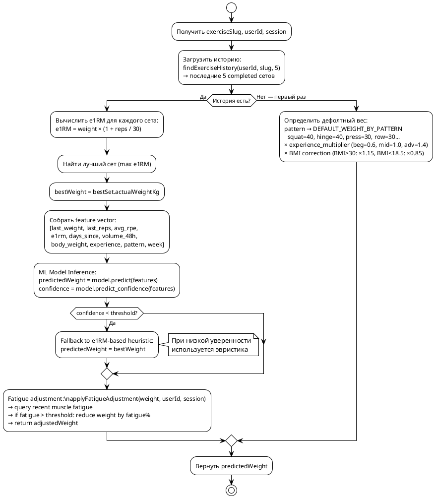

### 9.6 Генерация подходов

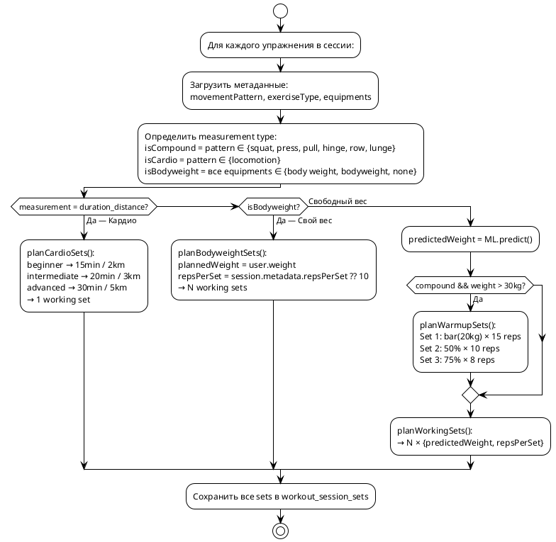

### 9.7 Прогрессивная перегрузка (через ML)

Модель автоматически управляет прогрессивной перегрузкой:

```
Правила (эвристика + ML confidence):

1. Все RPE ≤ 7 → progression:
   upper body: +2.5 kg
   lower body: +5.0 kg

2. Любой RPE ≥ 9 → regression:
   upper body: -1.25 kg
   lower body: -2.5 kg
   minimum: BAR_WEIGHT (20 kg)

3. Mixed RPE → maintain weight

4. ML override:
   Если confidence > 0.85 → использовать predicted weight
   вместо эвристической прогрессии
```

### 9.8 Fatigue adjustment

```
applyFatigueAdjustment(weight, userId, session):
  1. Загрузить completed sessions за 48 часов
  2. Вычислить volume_48h по мышечным группам упражнения
  3. Если volume_48h > weekly_target × 0.5:
     weight × (1 - min(0.15, fatigueRatio × 0.1))
  4. Вернуть скорректированный вес

Stub реализация сейчас → будет заменена на ML-based prediction
```

---

## 10. Dialog System

### 10.1 Конечный автомат диалога

```plantuml
@startuml Dialog_StateMachine
!theme plain
skinparam state {
    BackgroundColor #FFF3E0
}

[*] --> plan_type

plan_type --> goal : answer ∈ {generate, weekly}
goal --> experience
experience --> focus_muscles : generate only
experience --> equipment_preset : weekly only

focus_muscles --> equipment_preset : can skip
equipment_preset --> equipment : "manual"
equipment_preset --> frequency : preset selected
equipment --> frequency

frequency --> days : if not auto
frequency --> duration : if auto (skip days)
days --> duration

duration --> advanced_settings

advanced_settings --> **complete** : "recommended"
advanced_settings --> split : "manual" + weekly

split --> activity_level : weekly only
activity_level --> cardio_preference : goal ∈ {weight_loss, endurance}
activity_level --> primary_lifts : goal ∈ {strength, glute_growth}
activity_level --> endurance_type : goal = endurance
activity_level --> target_weight : goal = weight_loss

cardio_preference --> primary_lifts : goal ∈ {strength, glute_growth}
cardio_preference --> endurance_type : goal = endurance
cardio_preference --> target_weight : goal = weight_loss
cardio_preference --> **complete** : otherwise

primary_lifts --> endurance_type : goal = endurance
primary_lifts --> target_weight : goal = weight_loss
primary_lifts --> **complete** : otherwise

endurance_type --> target_weight : goal = weight_loss
endurance_type --> **complete** : otherwise

target_weight --> **complete**

**complete** --> [*]

note right of advanced_settings
  Gate: "recommended" → skip all advanced
  "manual" → goal-specific routing
end note

note right of goal
  Auto-skip if user.profile.goal set
end note

note right of experience
  Auto-skip if user.profile.experienceLevel set
end note

@enduml
```

### 10.2 16 шагов диалога

```
┌─────┬──────────────────┬───────────────┬──────────┬─────────┬──────────────────────────────────────┐
│  #  │ Step ID          │ inputType     │ canSkip  │ planType│ Описание                             │
├─────┼──────────────────┼───────────────┼──────────┼─────────┼──────────────────────────────────────┤
│  1  │ plan_type        │ single_choice │ Нет      │ both    │ generate или weekly                  │
│  2  │ goal             │ single_choice │ Нет      │ both    │ 9 целей                              │
│  3  │ experience       │ single_choice │ Нет      │ both    │ beginner/intermediate/advanced       │
│  4  │ focus_muscles    │ multi_choice  │ Да       │ generate│ Грудь/спина/ноги/.../всё тело        │
│  5  │ equipment_preset │ single_choice │ Да       │ both    │ Системные/пользовательские пресеты   │
│  6  │ equipment        │ multi_choice  │ Да       │ both    │ Ручной выбор из БД                   │
│  7  │ frequency        │ single_choice │ Нет      │ weekly  │ 2-6 или auto                         │
│  8  │ days             │ multi_choice  │ Нет      │ weekly  │ Дни недели                           │
│  9  │ duration         │ single_choice │ Нет      │ both    │ 20-120 мин или auto                  │
│ 10  │ advanced_settings│ single_choice │ Да       │ both    │ "Рекомендуемые" или "Настроить"      │
│ 11  │ split            │ single_choice │ Да       │ weekly  │ auto/full_body/upper_lower/ppl       │
│ 12  │ activity_level   │ single_choice │ Да       │ both    │ sedentary/light/moderate/active      │
│ 13  │ cardio_preference│ single_choice │ Да       │ both    │ any/running/cycling/rowing/...       │
│ 14  │ primary_lifts    │ multi_choice  │ Да       │ both    │ squat/bench/deadlift/ohp             │
│ 15  │ endurance_type   │ single_choice │ Да       │ both    │ muscular/cardio/mixed                │
│ 16  │ target_weight    │ number        │ Да       │ both    │ Целевой вес (кг)                     │
└─────┴──────────────────┴───────────────┴──────────┴─────────┴──────────────────────────────────────┘
```

### 10.3 Auto-skip из профиля

Шаги автоматически пропускаются, если в профиле пользователя уже есть ответ:

```
goal             → auto-skip если user.metadata.goal
experienceLevel  → auto-skip если user.metadata.experienceLevel
availableEquipment → auto-skip если user.metadata.availableEquipment
```

### 10.4 Goal-specific routing после advanced_settings gate

```
Если advanced_settings = "recommended" → сразу complete
Если advanced_settings = "manual":

  split           → только для weekly
  activity_level  → для всех
  cardio_preference → только если goal ∈ {weight_loss, endurance}
  primary_lifts   → только если goal ∈ {strength, glute_growth}
  endurance_type  → только если goal = endurance
  target_weight   → только если goal = weight_loss
```

---

## 11. Chat System

### 11.1 Архитектура двухрежимного чата

```plantuml
@startuml Chat_Architecture
!theme plain
skinparam componentStyle rectangle

package "Chat Module" {
    [ChatController] as Ctrl
    [ChatService] as Svc
    
    component "Mode: chat" as Chat {
        [ILLMProvider] as LLM
        [MockLLMProvider] as Mock
        [FitnessKnowledge\n(22 статьи)] as KB
    }
    
    component "Mode: workout" as Workout {
        [WorkoutDialogService] as Dialog
        [Dialog State Machine\n(16 шагов)] as SM
    }
}

database "chat_sessions" as CS
database "chat_messages" as CM
database "workout_dialogs" as WD

Ctrl --> Svc
Svc --> Chat : mode == "chat"
Svc --> Workout : mode == "workout"
Svc --> CS
Svc --> CM
Dialog --> WD

LLM ..> Mock : current impl
LLM ..> [Azure OpenAI\n(future)] as Azure : planned

@enduml
```

### 11.2 Жизненный цикл чат-сессии

```
1. POST /chat/sessions {mode: "chat" | "workout"}
   → chat_sessions {mode, userId}
   → если workout: создаётся workout_dialogs
   → первое сообщение assistant с вопросом диалога

2. POST /chat/sessions/:id/messages {content}
   → chat_messages {role: "user"}
   → если mode=workout:
       → dialogService.answerStep(dialogId, content)
       → если шаг валиден → следующий шаг или complete
       → если невалиден → повтор текущего вопроса
       → chat_messages {role: "assistant", metadata: {type: "dialog_step"}}
   → если mode=chat:
       → llmProvider.generateResponse(history, userContext)
       → chat_messages {role: "assistant"}

3. PATCH /chat/sessions/:id/mode {mode: "chat" | "workout"}
   → Переключение режима
   → При переключении на workout → startDialog
   → При переключении на chat → очистка dialogId

4. GET /chat/sessions → список сессий
5. GET /chat/sessions/:id → сессия + все сообщения
6. DELETE /chat/sessions/:id → удаление
```

### 11.3 ILLMProvider

```
Интерфейс:
  generateResponse(input: {
    messages: {role, content}[]
    userContext?: string
  }): Promise<{content: string}>

Текущая реализация: MockLLMProvider
  → keyword matching по ~22 статьям FITNESS_KNOWLEDGE
  → FALLBACK_RESPONSE при отсутствии совпадений

Запланированная реализация: Azure OpenAI Provider
  → GPT-4 / GPT-3.5
  → System prompt с фитнес-контекстом
  → User context (goal, level, gender)
```

### 11.4 Knowledge Base

22 статьи, покрывающие темы:
- Похудение, набор массы, белок, питание
- Сплиты, частота тренировок, разминка
- Кардио, силовые, техника упражнений
- Восстановление, перетренированность, сон
- Ягодицы, рельеф, возрастные тренировки
- Домашние тренировки, метаболизм, плато
- Домашние тренировки, мотивация

---

## 12. Справочник модулей и API

### 12.1 Модули NestJS

```
┌─────────────────────┬──────────────────────────────────────────────────────────────┐
│ Модуль              │ Ответственность                                              │
├─────────────────────┼──────────────────────────────────────────────────────────────┤
│ auth                │ JWT аутентификация по deviceId                               │
│ bodyparts           │ CRUD частей тела                                             │
│ muscles             │ CRUD мышц + антагонисты                                      │
│ equipments          │ CRUD оборудования                                            │
│ equipment-presets   │ Пресеты оборудования (системные + пользовательские)          │
│ exercises           │ Поиск, фильтрация, детали упражнений                        │
│ contraindications   │ CRUD противопоказаний                                         │
│ users               │ Профиль, вес, история веса                                   │
│ workout-milp        │ MILP генерация (одиночная + недельная)                       │
│ workout-dialog      │ 16-шаговый диалог создания тренировки                        │
│ chat                │ Чат (свободный + workout режим)                              │
│ workout-sessions    │ Сессии тренировок + SetPlanner + AutoSkip cron               │
│ workout-templates   │ Шаблоны тренировок                                           │
│ training-plans      │ Планы (CRUD + activate/archive + advance)                    │
│ home                │ Агрегированные данные для домашнего экрана                   │
└─────────────────────┴──────────────────────────────────────────────────────────────┘
```

### 12.2 API Endpoints

```
Аутентификация:
  POST   /auth/device          — Вход по deviceId

Пользователь:
  GET    /users/profile        — Профиль
  PATCH  /users/profile        — Обновить профиль
  GET    /users/weight-history — История веса

Чат:
  POST   /chat/sessions              — Создать сессию
  GET    /chat/sessions              — Список сессий
  GET    /chat/sessions/:id          — Сессия + сообщения
  DELETE /chat/sessions/:id          — Удалить сессию
  POST   /chat/sessions/:id/messages — Отправить сообщение
  PATCH  /chat/sessions/:id/mode     — Переключить режим

Диалог:
  POST   /workout-dialog/start         — Начать диалог
  POST   /workout-dialog/:id/answer    — Ответить на шаг
  GET    /workout-dialog/:id           — Текущее состояние
  DELETE /workout-dialog/:id           — Удалить диалог

MILP:
  POST   /workout-milp/generate     — Сгенерировать тренировку
  POST   /workout-milp/weekly-plan  — Сгенерировать недельный план
  POST   /workout-milp/metrics      — Вычислить метрики

Сессии:
  GET    /workout-sessions                        — Список (фильтры)
  GET    /workout-sessions/plan-session/:id       — По PlanSession
  GET    /workout-sessions/:id                    — Одна сессия
  POST   /workout-sessions                        — Создать
  POST   /workout-sessions/:id/complete           — Завершить
  POST   /workout-sessions/:id/skip               — Пропустить
  PATCH  /workout-sessions/:id                    — Обновить
  DELETE /workout-sessions/:id                    — Удалить

Планы:
  GET    /training-plans                 — Список планов
  GET    /training-plans/:id             — Один план
  POST   /training-plans                 — Создать
  PATCH  /training-plans/:id             — Обновить
  DELETE /training-plans/:id             — Удалить (неактивный)
  POST   /training-plans/:id/activate    — Активировать
  POST   /training-plans/:id/archive     — Архивировать
  POST   /training-plans/:id/assign      — Назначить шаблон
  DELETE /training-plans/:id/assign/:day — Снять назначение
  POST   /training-plans/sessions/:id/replace — Заменить тренировку

Шаблоны:
  GET    /workout-templates              — Список
  GET    /workout-templates/:id          — Один шаблон
  POST   /workout-templates              — Создать
  PATCH  /workout-templates/:id          — Обновить
  DELETE /workout-templates/:id          — Удалить

Упражнения:
  GET    /exercises                     — Поиск (пагинация, фильтры)
  GET    /exercises/:slug               — Детали упражнения

Домашний экран:
  GET    /home/data                     — Агрегированные данные
```

### 12.3 Сущности (Entity Layer)

```
┌──────────────────────────┬─────────────────────────────────────────────────────┐
│ Entity                   │ Ключевые поля                                       │
├──────────────────────────┼─────────────────────────────────────────────────────┤
│ User                     │ id, deviceId, name, gender, weight, height, age,   │
│                          │ contraindications[], metadata (JSONB)               │
│ UserMetadata             │ goal, experienceLevel, availableEquipment[],        │
│                          │ defaultEquipmentPresetId, trainingAgeMonths,        │
│                          │ recoveryCapacity, injuryHistory, preferredExercises │
│ Exercise                 │ exerciseId, name, slug, gifUrl, targetMuscles[],   │
│                          │ exerciseType, difficulty, movementPattern, metadata │
│ ExerciseMetadata         │ complexityScore, phaseAffinity, fatigueCost,        │
│                          │ primaryMuscleWeights[], secondaryMuscleWeights[],   │
│                          │ variationGroup, timeCostSec, riskLevel              │
│ WorkoutTemplate          │ id, userId, name, exercises[], metadata             │
│ TrainingPlan             │ id, userId, name, isActive, source, schedule[]      │
│ TrainingPlanScheduleItem │ dayOfWeek, workoutTemplateId, time, name, sortOrder │
│ TrainingPlanSession      │ id, planId, userId, startedAt, currentWeek, status  │
│ WorkoutSession           │ id, planSessionId, userId, dayOfWeek, status,       │
│                          │ exercises[], metadata                               │
│ WorkoutSessionSet        │ sessionId, exerciseSlug, setNumber, setType,        │
│                          │ planned/actual weight/reps/duration/distance/rpe    │
│ ChatSession              │ id, userId, mode, dialogId, title                   │
│ ChatMessage              │ id, sessionId, role, content, metadata              │
│ WorkoutDialog            │ id, userId, currentStep, planType, collectedParams  │
│ EquipmentPreset          │ id, userId, name, slug, isSystem, equipmentSlugs[]  │
│ WeightLog                │ id, userId, weight, createdAt                       │
└──────────────────────────┴─────────────────────────────────────────────────────┘
```

### 12.4 Жизненный цикл WorkoutSession

```
planned ──────→ completed    (POST /:id/complete с actual sets)
  │
  ├──────────→ skipped       (POST /:id/skip)
  │                │
  │                └──────→ replaced  (POST sessions/:id/replace)
  │
  └──────────→ skipped       (AutoSkip cron, полночь)

Статусы:
  planned   — запланирована, SetPlanner назначил подходы
  completed — пользователь выполнил, actual данные записаны
  skipped   — пропущена (вручную или cron)
```

### 12.5 Жизненный цикл TrainingPlan

```
Создание (manual/milp):
  → {isActive: false, source: 'manual'|'milp'}

Активация:
  → isActive: true
  → PlanSession {status: 'active', currentWeek: 1}
  → WorkoutSessions × N (planned)

Выполнение (4 недели):
  → complete/skip сессии
  → advanceAfterComplete продвигает неделю
  → SetPlanner для следующей сессии

Завершение:
  → week > 4 → auto-archive PlanSession
  → Или ручная архивация: POST /:id/archive
  → isActive: false
```

---

> **Версия документа**: 1.0
> **Обновлено**: 2026-05-20
> **Исходный код**: `src/` (NestJS TypeScript)
